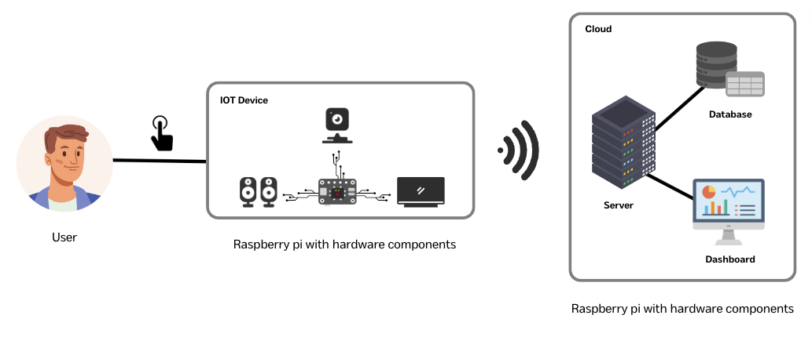
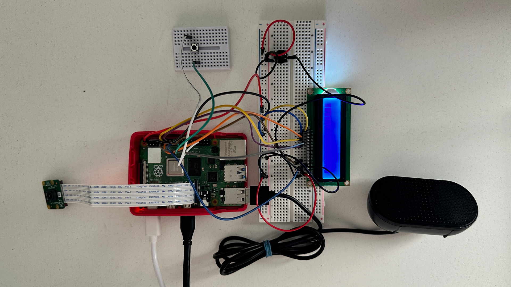

# Vision Caster

This project involves the development of an interactive image analysis and feedback system designed specifically for visually impaired users. By integrating the BLIP (Bootstrapping Language-Image Pre-training) model from Salesforce, optimized for CPU usage, the system processes images on a Raspberry Pi to provide real-time descriptive captions and auditory feedback.

<div align=center>
 
</div>


## System Overview

The system captures images using the Raspberry Pi Camera Module 2, processes these images to generate descriptive captions through the BLIP model, and communicates these captions audibly through a USB speaker. Additionally, system statuses and captions are displayed on an LCD screen in real-time. The system also supports uploading the image and its caption to a custom-built Azure server for record-keeping.


<div align=center>
 
</div>


## Key Features
- **Real-time Image Processing**: Captions generated in real-time to reduce latency and enhance usability for visually impaired users.
- **Auditory Feedback**: Descriptive captions and system statuses provided through auditory output, enhancing accessibility.
- **Visual Display**: LCD screen displays captions and system statuses for users with partial vision.
- **Cloud Integration**: Captions and images are stored on an Azure server, allowing for remote access and further analysis.
<br/>


## Hardware Components
- **Raspberry Pi 4**
- **Raspberry Pi Camera Module 2**
- **Button**
- **LCD Display (Model LCD1602)**
- **USB Speaker**
<br/>


<div align=center>
 
</div>
<br/>


## Software Architecture
- **Operating System**: Raspberry Pi OS
- **Machine Learning Model**: BLIP model for image captioning
- **Audio Feedback**: gTTS library for text-to-speech conversion
- **Cloud Services**: Microsoft Azure for backend infrastructure
<br/>


## Pre-requisites

##### Conda Environment
Create a separate conda environment with the python version 3.11 using the following command:

```
conda create -n visioncaster python=3.11
```

then activate the environment:

```
conda activate visioncaster
```
 
and install the required libraries using the following command:

```
pip install -r requirements.txt
```
<br/>


## Usage


```bash
# activate the conda environment
conda activate visioncaster

# run the flask application
python run.py
```

<br/>
